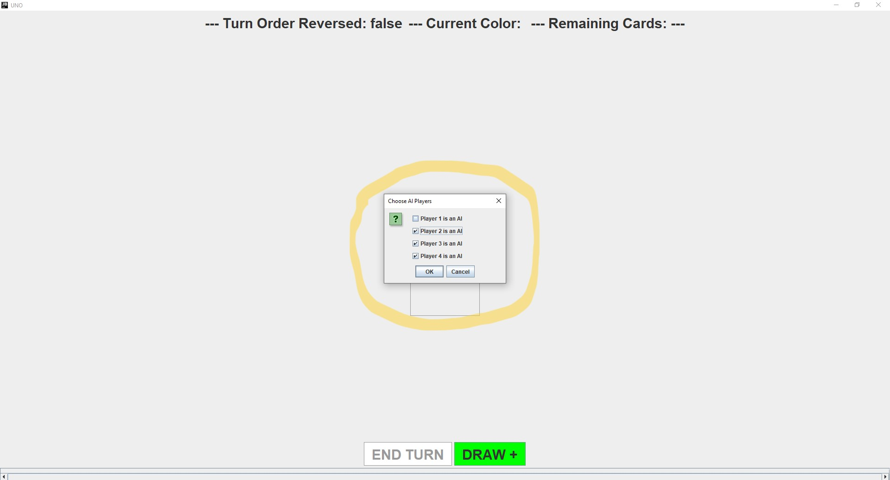
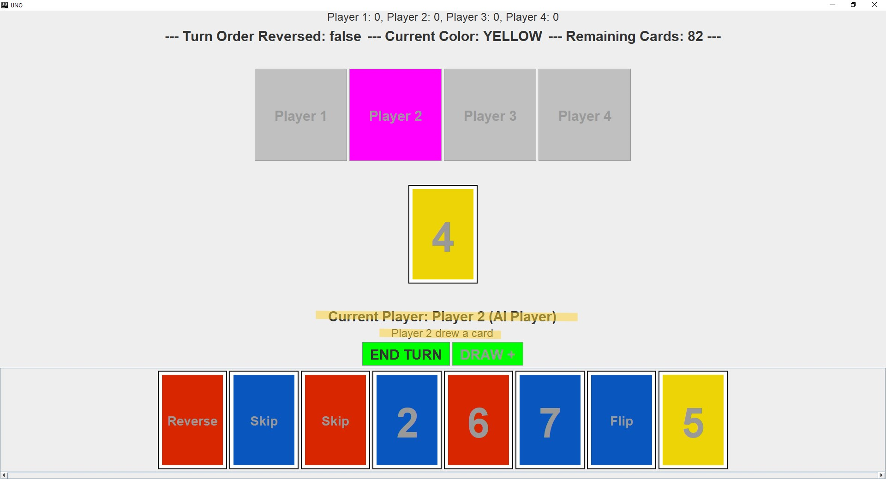

# UNO-Flip (Milestone 3)

## Description
This project simulates a game of UNO-Flip played with cards from the light side and cards from the dark side. In this game, players are trying to be the first to get rid of all the cards in their hand. In turn order, players play cards to the draw pile matching by either color, number, or special action. Players have the capability to view their drawn cards, place cards, draw additional cards, execute special card actions, and observe the resulting state of the cards.

Milestone 1 implemented the basic UNO game using a text based interface. Milestone 2 converted the text-based interface into to a graphical user interface. Milestone 3 intergrates the dark side of the deck and added AI player capabilities.

## Contents
This project contains the following deliverables:
* Source code
* UNO-Flip executable
* UML sequence diagrams
* UML class diagram
* Design explanation
* [AI Logic explanation](AI%20Logic.md)

## Installation
This project was compiled with Java 14, so make sure you run it with Java version 14 or ensure your Java version can run Java version 14.

## Usage
Navigate to the project folder in the command prompt then enter:
> java -jar UNO-Flip.jar

Pick how many players are playing:

Enter a unique name for each of the players:

Choose a card from the current player's hand matching the color or symbol of the pile of cards in the middle:

When you click the card, the drawpile will update immediately. Click the "END TURN" button to progress to the next player's turn:

To draw a card, click the "DRAW +" button:

When you play a WILD card, you will be prompted to choose a colour:

A Flip card flips all the cards in the game from Light to Dark or from Dark to Light:

After the Flip card is played:

The direction of play, the current color, and the remaining cards can be seen in a panel at the top of the interface:

The current player is shown above the "END TURN" Button, as well as in a magenta highlight above the drawpile:

Players do not need to say UNO when they only have 1 card left:

Once a player plays their last card, the round will end:

When you hit continue, then a new game will begin and the scores will be updated:

## AI Player Implementation
After you have chosen the number of players and the name of each player, you are prompted to choose which players will be AI players:

You are free to choose from the list of players which players will be AI players:

You will be prevented from starting a game where every player is an AI player:

The game will display a player's status as an AI player and, if a player is an AI player, their action this turn:

In the event that an AI player chooses to play a wild card, the game will clarify this action accordingly:

In the event that an AI player chooses to play a flip card, the game will clarify this action accordingly:

## Assumptions
* If the starting card is not a normal card, ignore the effect but can still play on the color/pick any color if it is a wild
* If the first card flipped from the deck is a wild card, the starting player can play a card of any color
* When a player places their last card, their score is displayed, the deck is reshuffled, new hands are dealt, and the game restarts
* If you draw a valid card you may choose to end your turn without playing it
* Choosing player count, player names, and WILD cards colours are mandatory
* You may play WILD cards any time
* Players do not need to say UNO
* A new round begins with player 1
* The max number of players is still 4
* Any number of the players can be AI as long as there is still at least 1 non-AI player
* If a player is playing the last card in their hand, the card's effect will take place before the end of a round
* The game allows a player to play any valid card from their hand after they draw, not just the drawn card

## Credits
Milestone 1 Completion: October 22, 2023  
Milestone 2 Completion: November 14, 2023  
Milestone 3 Completion: November 26, 2023

Authors:
* Anand Balaram - 101217776
* Fiona Cheng - 101234672
* Jackie Smolkin-Lerner - 101184457
* Jake Siushansian - 101226956

## Class Diagram

## Sequence Diagrams
### Initialize

### Start Game

### Playing Game

### AI Player - Play Card

### AI Player - Change Colour
